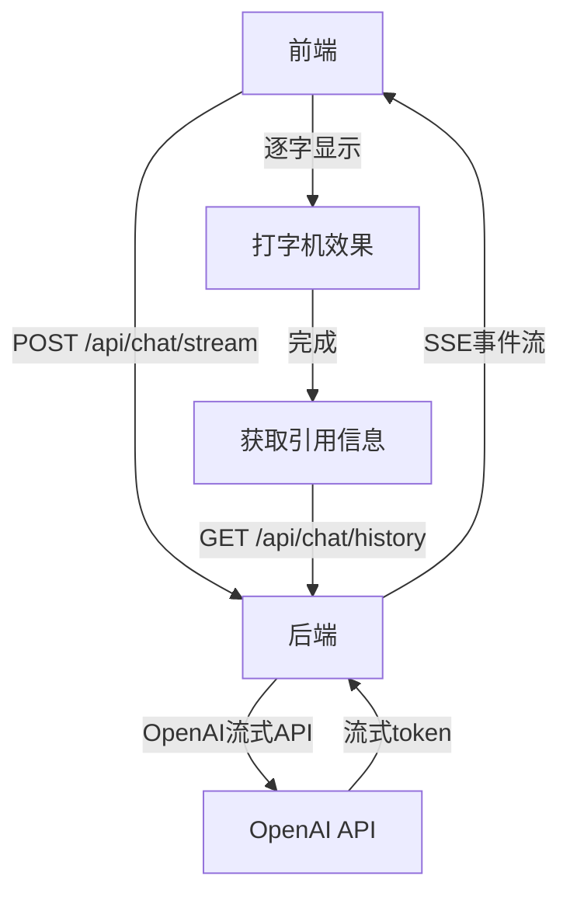

# 前端流式输出设计文档

## 概述

将前端从一次性输出改为流式输出，实现打字机效果，提升用户体验。

## 需求分析

### 用户需求
1. **打字机效果**：逐字显示生成的回答
2. **SSE传输**：使用Server-Sent Events实现流式传输
3. **引用信息处理**：在回答生成完成后显示引用信息
4. **加载状态**：显示打字机动画作为加载状态

### 技术约束
- 保持现有后端API的向后兼容性
- 前端使用React + TypeScript
- 后端使用FastAPI + OpenAI API

## 整体架构设计



## 后端API设计

### 新增端点
- **路径**: `POST /api/chat/stream`
- **请求体**: `{"query": "用户问题"}`
- **响应格式**: Server-Sent Events

### SSE事件类型
1. **token事件**: 包含生成的token
   ```
   event: token
   data: {"content": "你"}
   ```
2. **done事件**: 流式完成信号
   ```
   event: done
   data: {"full_response": "完整回答"}
   ```
3. **error事件**: 错误信息
   ```
   event: error
   data: {"message": "错误信息"}
   ```

### 实现细节
- 使用OpenAI的`stream=True`参数
- 保持现有`/api/chat/`端点不变
- 异步生成器处理流式响应

## 前端API调用设计

### 新增API方法
```typescript
// services/api.ts
export const chatApi = {
  // 现有方法...
  
  sendMessageStream(query: string): EventSource {
    const url = new URL(`${API_BASE}/chat/stream`, window.location.origin);
    url.searchParams.append('query', query);
    return new EventSource(url.toString());
  }
};
```

### 新增Hook
```typescript
// hooks/useChatStream.ts
export function useChatStream() {
  const [messages, setMessages] = useState<ChatMessage[]>([]);
  const [streamingMessage, setStreamingMessage] = useState<string>('');
  const [isStreaming, setIsStreaming] = useState(false);
  const [error, setError] = useState<string | null>(null);
  
  const sendStreamMessage = useCallback(async (query: string) => {
    setIsStreaming(true);
    setError(null);
    setStreamingMessage('');
    
    // 添加用户消息
    setMessages(prev => [...prev, { role: 'user', content: query }]);
    
    try {
      const eventSource = chatApi.sendMessageStream(query);
      let fullResponse = '';
      
      eventSource.addEventListener('token', (event) => {
        const data = JSON.parse(event.data);
        fullResponse += data.content;
        setStreamingMessage(fullResponse);
      });
      
      eventSource.addEventListener('done', () => {
        setMessages(prev => [
          ...prev,
          { role: 'assistant', content: fullResponse }
        ]);
        setStreamingMessage('');
        setIsStreaming(false);
        eventSource.close();
        
        // 获取引用信息
        chatApi.getHistory().then(history => {
          // 处理引用信息...
        });
      });
      
      eventSource.addEventListener('error', (event) => {
        const data = JSON.parse(event.data);
        setError(data.message);
        setIsStreaming(false);
        eventSource.close();
      });
      
      eventSource.onerror = () => {
        setError('连接中断，请重试');
        setIsStreaming(false);
        eventSource.close();
      };
    } catch (err) {
      setError(err instanceof Error ? err.message : '发送消息失败');
      setIsStreaming(false);
    }
  }, []);
  
  return { messages, streamingMessage, isStreaming, error, sendStreamMessage };
}
```

## 前端UI组件设计

### 新增组件
1. **StreamingMessage**: 显示正在流式输出的消息
   - 逐字显示效果
   - 光标闪烁动画
   - 支持Markdown渲染

2. **TypingIndicator**: 打字机动画组件
   - 三个点的动画效果
   - 在流式开始前显示

### 修改组件
1. **ChatWindow**: 使用新的useChatStream hook
2. **MessageList**: 支持显示streamingMessage
3. **MessageInput**: 在流式过程中禁用输入

## 错误处理设计

### 后端错误处理
- 通过SSE的`error`事件传递错误信息
- 捕获OpenAI API异常并转换为友好的错误信息

### 前端错误处理
1. **网络错误**: 显示错误信息，允许重试
2. **超时处理**: 设置30秒超时，超时后显示错误
3. **回退机制**: 流式失败时回退到现有非流式API
4. **用户界面**: 错误时不中断对话，显示友好的错误信息

## 实现步骤

### 后端实现
1. 修改`backend/rag/generator.py`，添加流式生成方法
2. 修改`backend/agent/behavior.py`，添加流式聊天方法
3. 修改`backend/api/chat.py`，添加流式API端点
4. 添加必要的依赖（sse-starlette）

### 前端实现
1. 修改`frontend/src/services/api.ts`，添加流式API方法
2. 创建`frontend/src/hooks/useChatStream.ts` hook
3. 创建`frontend/src/components/Chat/StreamingMessage.tsx`组件
4. 创建`frontend/src/components/Chat/TypingIndicator.tsx`组件
5. 修改`frontend/src/components/Chat/ChatWindow.tsx`组件
6. 修改`frontend/src/components/Chat/MessageList.tsx`组件

## 测试策略

### 单元测试
1. 后端流式API测试
2. 前端hook测试
3. 组件渲染测试

### 集成测试
1. 端到端流式对话测试
2. 错误场景测试
3. 性能测试

## 部署考虑

### 依赖更新
- 后端：添加sse-starlette依赖
- 前端：无需新增依赖

### 配置更新
- 无需修改现有配置

### 向后兼容性
- 保持现有API端点不变
- 前端可以优雅降级到非流式模式

## 风险评估

### 技术风险
1. **SSE兼容性**: 现代浏览器都支持，风险低
2. **性能影响**: 流式传输可能增加服务器负载，需要监控
3. **错误处理**: 流式过程中的错误处理需要特别注意

### 缓解措施
1. 实现回退机制，确保在SSE不可用时能正常工作
2. 添加适当的超时和重试逻辑
3. 完善的错误处理和用户反馈

## 成功标准

### 功能标准
1. 实现打字机效果的流式输出
2. 引用信息在流式完成后正确显示
3. 错误处理完善，用户体验良好

### 性能标准
1. 首个token显示延迟 < 500ms
2. 流式输出流畅，无卡顿
3. 内存使用合理，无泄漏

### 用户体验标准
1. 打字机效果自然流畅
2. 加载状态清晰明确
3. 错误信息友好易懂